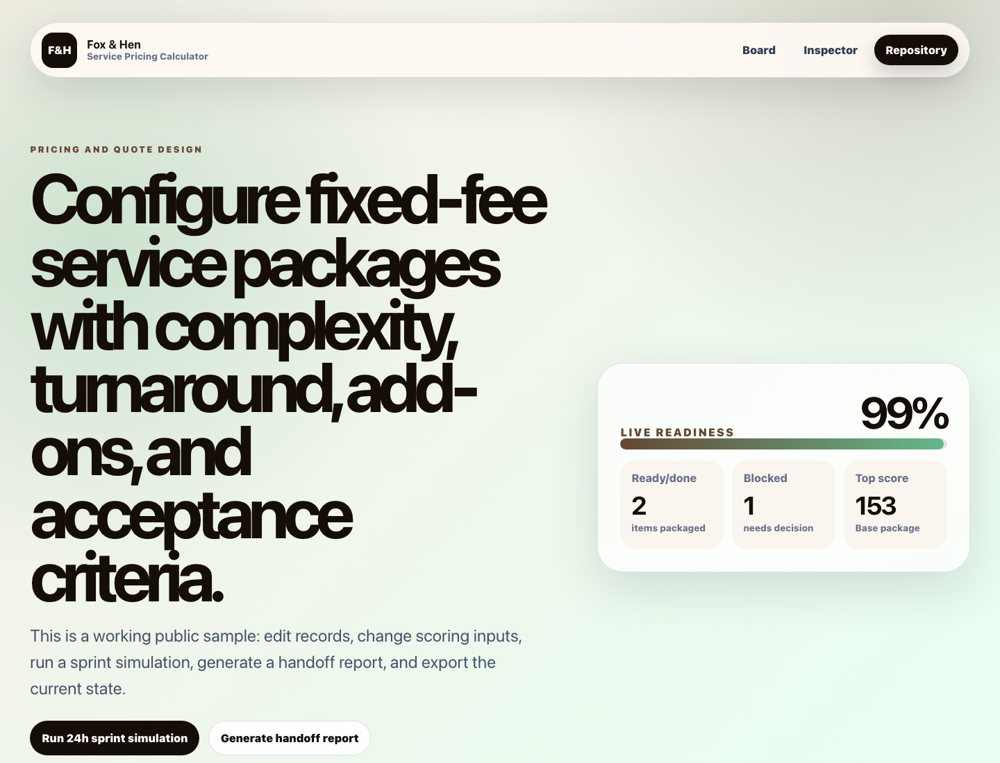

# Service Pricing Calculator

[](https://github.com/foxandhenllc/foxhen-service-pricing-calculator/actions/workflows/build.yml)

Service pricing calculator for packages, add-ons, rush fees, complexity, assumptions, and quote summaries.



## Live Demo

- Demo: [https://freetoolsforpeople.com/service-pricing-calculator](https://freetoolsforpeople.com/service-pricing-calculator)
- Repository: [https://github.com/foxandhenllc/foxhen-service-pricing-calculator](https://github.com/foxandhenllc/foxhen-service-pricing-calculator)

## Purpose

Service pricing calculator for packages, add-ons, rush fees, complexity, assumptions, and quote summaries.

## Fully Working Behaviors

- Search, filter, and sort the sample work board.
- Add a new sample item and edit owner, notes, priority, value, effort, and friction.
- Advance work status and watch readiness metrics update.
- Run the 24-hour sprint simulation to reprioritize high-value items.
- Toggle QA gates, generate a handoff report, and download the current board as JSON.

## Service Mapping

This repo packages a focused, public-safe workflow around:

- Ranked board
- Editable item inspector
- Readiness checklist
- Exportable handoff report

The app is intentionally static so prospects can inspect the flow, fork it, and replace only the fictional sample records in `src/data.ts`.

## Fork This Demo

1. Replace the fictional work items in `src/data.ts` with your own public-safe sample scenario.
2. Update colors, service copy, repository URL, and live demo URL in the same file.
3. Keep screenshots, exported JSON, and README examples free of credentials, real customer data, and personal contacts.
4. Run `npm run build --silent` before publishing.

See `docs/forking-guide.md` for a checklist and starter client brief.

## SEO / AIO Discoverability

**Plain-language answer:** Use this repo to configure service packages with add-ons, rush fees, complexity, assumptions, and quote summaries.

**Who it helps:** freelancers, consultants, and agencies that sell fixed-fee services.

**Search intents covered:**

- service pricing calculator
- fixed fee quote calculator
- agency pricing template
- quote assumptions exclusions generator

**Why this repo is useful:** It makes pricing logic more transparent and packages assumptions/exclusions so buyers understand what is included before work starts.

## Open Source Readiness

- MIT licensed for reuse, remixing, and client-safe adaptation.
- GitHub Actions build workflow runs install, typecheck, tests when present, and production build.
- Contribution guide, roadmap, and issue templates are included for public collaboration.
- Public-safe data policy keeps examples fictional and reviewable.

## Local Run

```bash
npm install
npm run dev
npm run build
```

## Validation

```bash
npm run typecheck --if-present
npm run test --if-present
npm run build --if-present
```

## Public-Safe Scope

This is a static React/Vite demo with fictional sample data. It includes no production data, credentials, real contacts, copied customer work, backend, auth, or external service calls.

## Contributing

See `CONTRIBUTING.md` for public-safe contribution rules, local validation commands, and good first contribution ideas. Roadmap items live in `ROADMAP.md`.

## License

MIT - see `LICENSE`.
